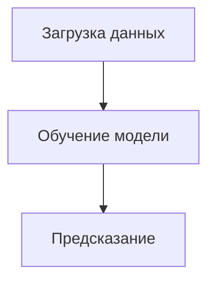

# Экзаменационный проект: Автоматизация и оркестрация пайплайна машинного обучения с использованием Apache Airflow и облачного хранилища.

## 📝 Описание проекта
В рамках проекта мы планируем на ежедневной основе загружать датасет Breast Cancer Wisconsin Diagnostic из [источника](https://archive.ics.uci.edu/ml/machine-learning-databases/breast-cancer-wisconsin/wdbc.data), обучать на его основе модель логистической регрессии и делать предсказания для новых данных  

## 💨 Структура пайплайна
ML пайплайн состоит из трёх этапов:
1. Загрузка и проверка данных.
Скрипт `load_data.py` загружает данные из источника и сохраняет их в папке **/results/data** в формате `breast_cancer_data_{today()}.csv`. В папку **/logs/data_quality** записываем размер полученного датасета и пропуски в нём
2. Обучение модели
Скрипт `train_model.py` обучает модель логистической регрессии на датасете, который был загружен сегодня (если его нет, то ищет последний загруженный датасет). Модель сохраняется в папке **/results/models** в формате `model_{today()}.pkl`. Здесь же сохраняется файл с метриками этой модели в формате .txt
3. Предсказание типа опухоли
Скрипт `predict.py` загружает последний скачанный датасет и ресемплирует его случайным образом, имитируя таким образом реальные данные. Последняя обученная модель предсказывает для каждой записи в ресемплированных данных тип опухоли: доброкачественная/злокачественная и сохраняет предсказания в папку **/results/predictions** в формате `predictions_{today}.csv`  
  
**Предпочтителен запуск через Airflow (поднимается с помощью docker-compose.yml), но возможно исполнение через терминал*



## 🧱 Структура репозитория

```
├── dags/              # DAG'и Airflow
├── etl/               # Скрипты каждого этапа
├── logs/              # Логирование процессов
├── results/           # Данные, модели, предсказания
├── .gitignore         # Файлы для исключения
├── docker-compose.yml # docker конфиг
├── requirements.txt   # Библиотеки для Python
├── README.md          # Этот файл
```

## 🚀 Установка и локальный запуск проекта с Apache Airflow
#### 📦 1. Клонируйте репозиторий

```bash
git clone https://github.com/your-username/your-repo-name.git
cd your-repo-name
```
#### 👨‍🔧 2. Постройте Docker-образы
```bash
docker-compose build
```
#### 🥫 3. Инициализируйте базу данных Airflow
```bash
docker-compose up airflow-init
```
#### ▶️ 4. Запустите все сервисы Airflow
```bash
docker-compose up -d
```
После запуска web-интерфейс Airflow будет доступен по адресу http://localhost:8080
- Логин: admin
- Пароль: admin
#### 5. ✅ Проверка запуска
После запуска интерфейса Airflow:  
- Перейдите на вкладку DAGs  
- Активируйте DAG load_train_predict_dag  
- Нажмите кнопку ▶️ (Trigger) для ручного запуска  

## 🚫 "Узкие" места пайплайна
- Нет уведомления об ошибках
- Сейчас при *любой* ошибке Airlow пытается запустить код снова, что не всегда корректно
- Весь код разбит на три этапа. При обучении больших моделей любая ошибка становится критичной
- Мы не учитываем возможные ошибки в данных или в модели если они были успешно загружены
- Объёма локальных хранилищ может не хватать. Сложность быстрого масштабирования
Несмотря на вышеперечисленные недостатки, пайплайн более менее устойчив к проблемам с источником (модель продолжит обучаться на последних загруженных валидных данных), а в случае с невозможностью обучить модель Airflow просто пропустит этот шаг, перейдя к предсказаниям с помощью рабочей модели

## 🔍 Что можно улучшить:
- Интеграция мониторинга и алертинга
- Интеграция с облачными хранилищами
- Более точная обработка ошибок
